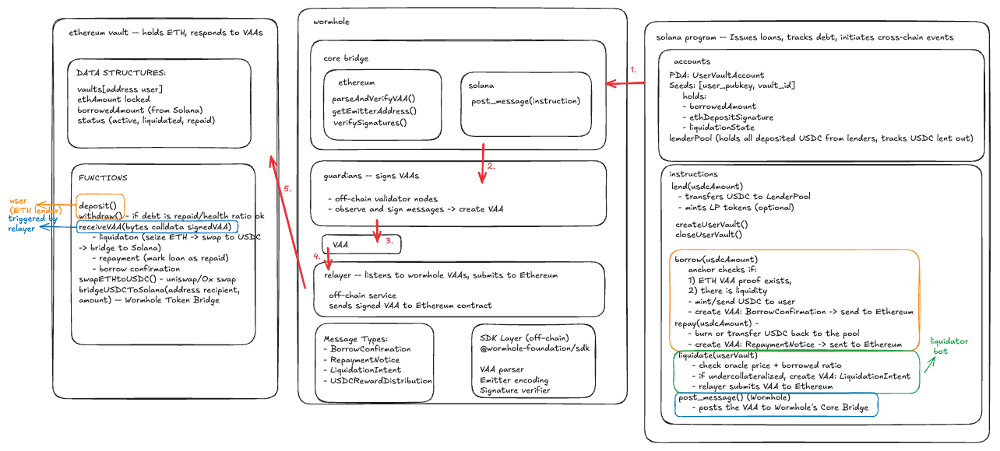
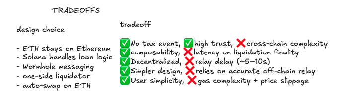

# Soliver 

**Soliver** is a cross-chain lending protocol that enables users to deposit ETH on Ethereum and borrow USDC on Solana—without selling or bridging their ETH.

Built during the Solana Global Hackathon 2025.

## ✨ What It Does

- 📦 Users deposit ETH into a Vault smart contract on Ethereum.
- 💵 They borrow USDC on Solana (and optionally auto-swap to SOL).
- 🔁 Wormhole bridges loan messages securely between chains.
- 📈 Lenders provide USDC liquidity and earn yield.
- 🧠 Liquidation bots and relayers keep the system decentralized.

## 🧱 Architecture Overview

- **Ethereum (Solidity)**:  
  `Vault.sol` manages ETH collateral and handles VAA messages.
- **Solana (Anchor)**:  
  `soliver` program issues USDC loans, tracks borrowing, and manages lenders.
- **Wormhole (Cross-chain)**:  
  Wormhole Core Bridge + Guardians sign messages between chains.
- **Relayer (Node.js)**:  
  Submits VAAs to Ethereum on behalf of the Solana program.

  

## 🔧 Features (MVP)

- `deposit()` and `withdraw()` ETH on Ethereum
- `lend()`, `borrow()`, `repay()`, and `liquidate()` USDC on Solana
- Oracle-driven liquidation using Switchboard
- Wormhole-based cross-chain messaging
- Manual off-chain relayer (TypeScript bot)

## 📁 Repo Structure

<pre> 
  soliver/
  ├── contracts/ (Ethereum - Solidity Vault) 
  ├── programs/ (Solana - Anchor lending program) 
  ├── relayer/ (VAA relay bot - TypeScript) 
  ├── shared/ (Constants, messageTypes, emitter data) 
  └── README.md
</pre>

## 🔒 Security Assumptions

- ETH never leaves Ethereum → safer custody
- VAA must be signed by Wormhole Guardians
- `receiveVAA()` verifies emitter address
- Liquidation logic is decentralized via bots

 

## 🗺️ Future Plans

- Full automation of relaying + liquidation routing
- Permissionless liquidation rewards
- Jito (Re)staking for NodeOperators-based liquidation quorum
- Additional collateral types: stETH, cbETH
- UX improvements for 1-click onboarding

## 📜 License

MIT License

**Soliver**: *Don’t sell ETH. Soliver it.*

